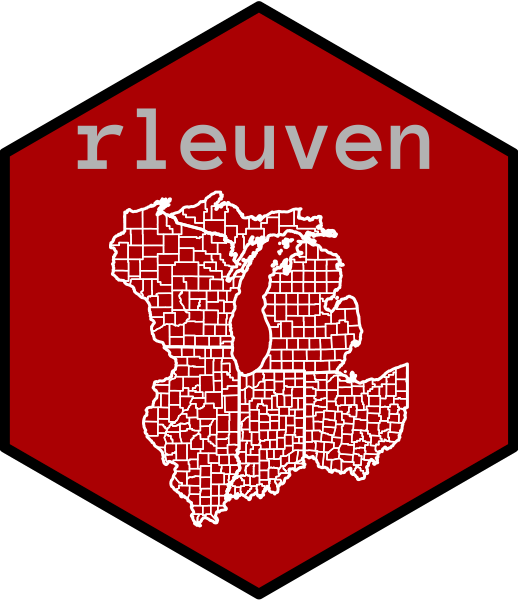

# The "rleuven" R Package

  

This is a package that contains several functions and frequently-used datasets that make my life easier.

### Functions I Use:

* [**Frequency Table**](https://github.com/andrewvanleuven/rleuven/blob/master/R/freqTab.R): Create a frequency table of unique values in a data column.
* [**Number of NAs**](https://github.com/andrewvanleuven/rleuven/blob/master/R/num_of_NAs.R): Create a table displaying the number of "NA" values in each column.
* [**Random Discrete Color Palette**](https://github.com/andrewvanleuven/rleuven/blob/master/R/rand_ncolors.R): Uses a data frame to create a vector of random color codes (one per row of data frame).
* [**Spatial Centroid XY**](https://github.com/andrewvanleuven/rleuven/blob/master/R/st_centroid_xy.R): Creates two columns in a simple features (sf) data frame that correspond to the X and Y coordinates of the polygon.
* [**Spatial Dissolve**](https://github.com/andrewvanleuven/rleuven/blob/master/R/st_dissolve.R): Dissolves smaller spatial geometry into larger geometry.

***

*For more about me, see my personal [website](https://andrewvanleuven.com/).*
